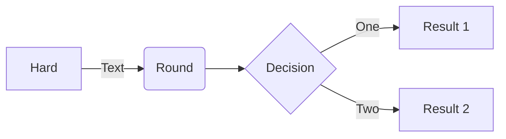
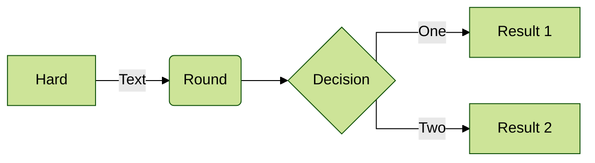
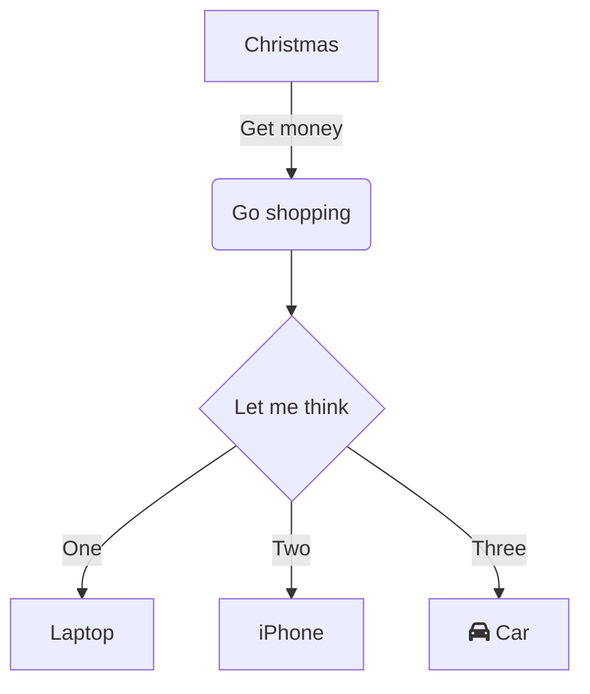
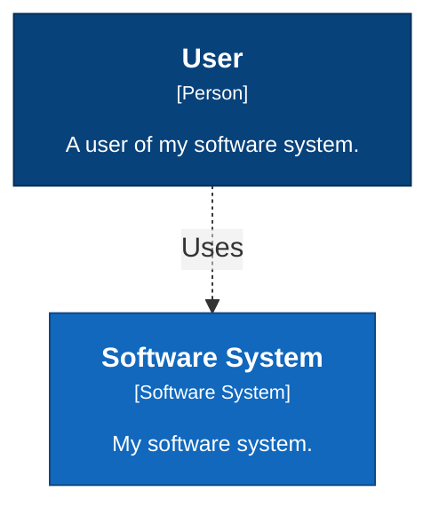

Mermaid embedded in markdown:

mermaid with theme and stright arrow:

Graph with font awesome (not rendered on Github):

- C4 model, haven't native supported by mermaid yet  
Alternative:
    * https://github.com/mermaid-js/mermaid/issues/1276#issuecomment-802139353
    * https://structurizr.com/dsl?example=getting-started

Example:

